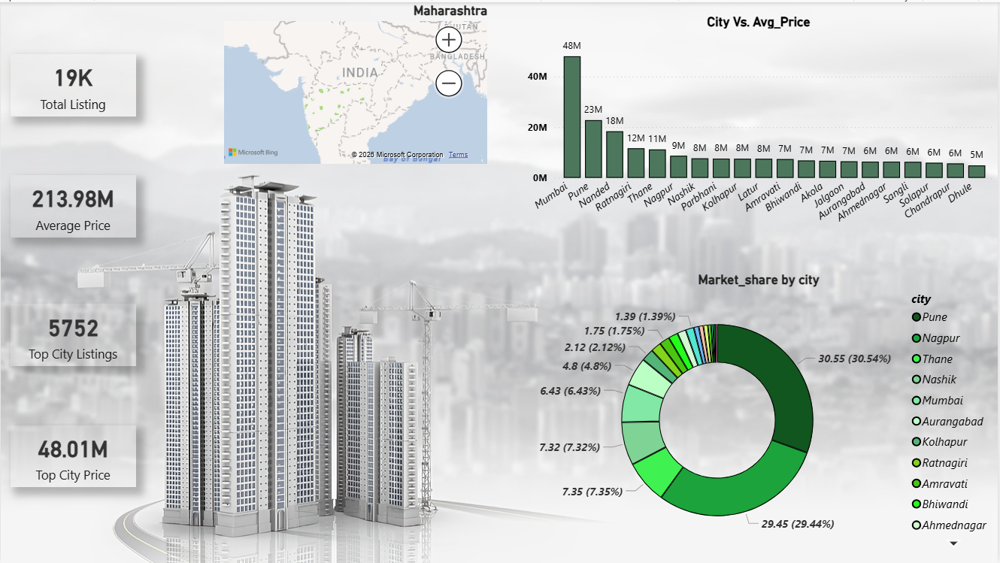
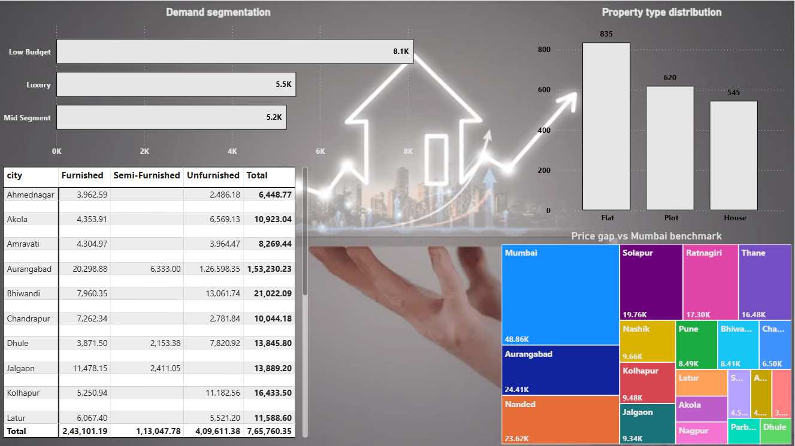

# 🏠 Real Estate Market Intelligence Analysis – Maharashtra

## 📊 Project Overview
This project analyzes 15,000+ real estate listings across Maharashtra to uncover pricing trends, demand patterns, and investment opportunities.

## 🎯 Objectives
- Identify city-wise pricing and supply trends
- Analyze demand segmentation (budget categories)
- Evaluate impact of furnishing and property status on pricing
- Detect market concentration and dominance
- Recommend high-growth investment areas

## 🛠 Tools Used
- SQL (Data Analysis)
- Power BI (Dashboard)
- Excel (Data Cleaning)

## 📈 Key Insights
- Pune and Nagpur contribute ~60% of total listings
- Mumbai commands ~60% premium pricing over Thane
- Mid-segment properties dominate demand
- Furnished + ready-to-move properties have highest valuation
- Identified undervalued high-inventory areas for investment

## 📊 Dashboard Preview

## 🚀 Business Impact
- Helps investors identify high-growth zones
- Supports pricing strategy for developers
- Enables data-driven decision making

## 📂 Project Files
- SQL Queries: ` Maharashtra.sql`
- Dashboard: `dashboard.pbix`
- Dataset: ` Maharashtra.csv`
